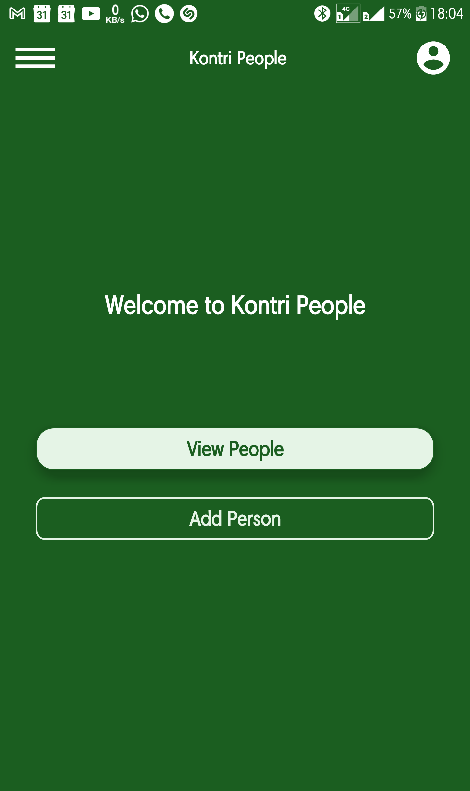
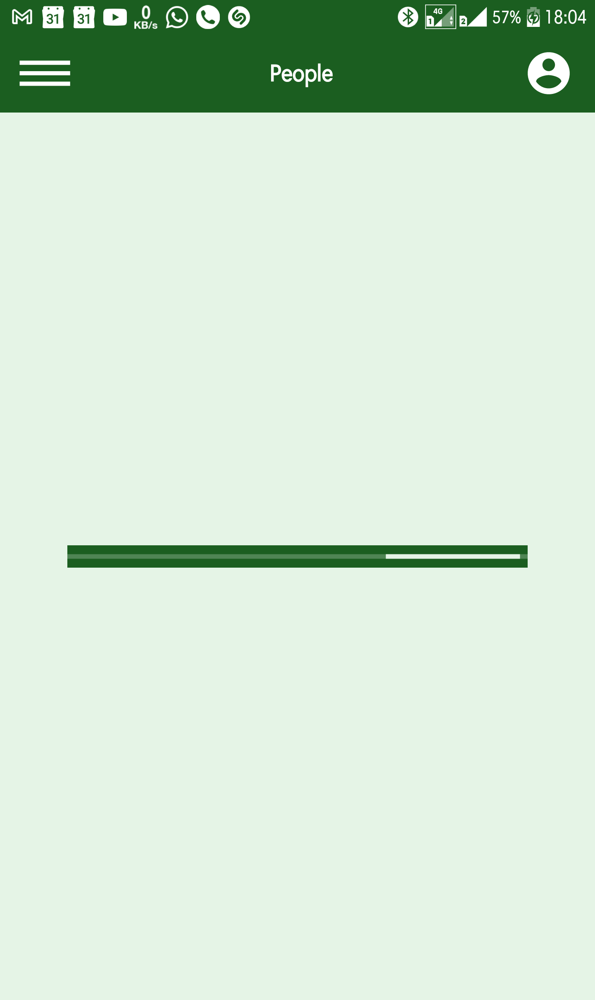
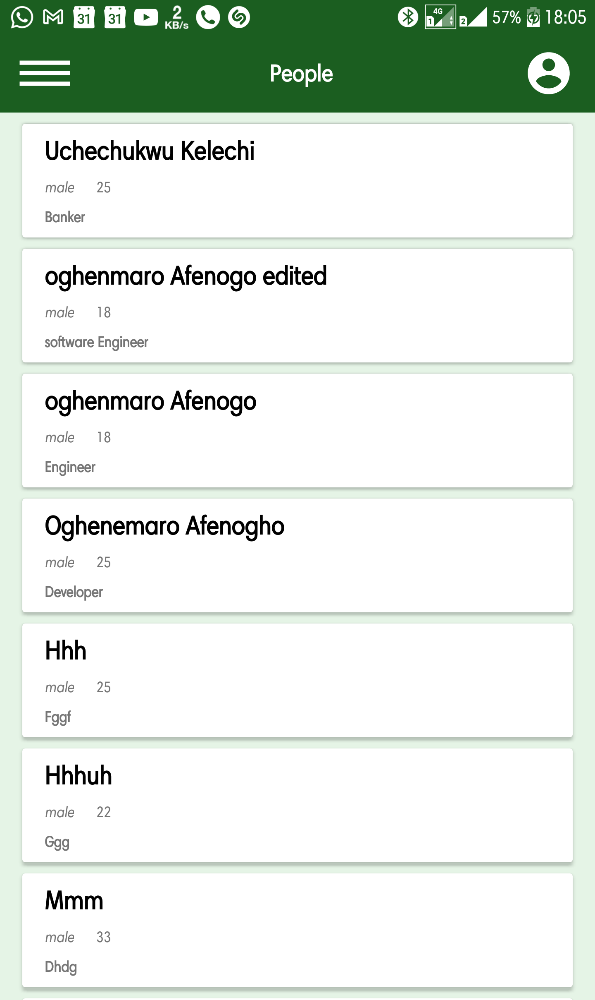
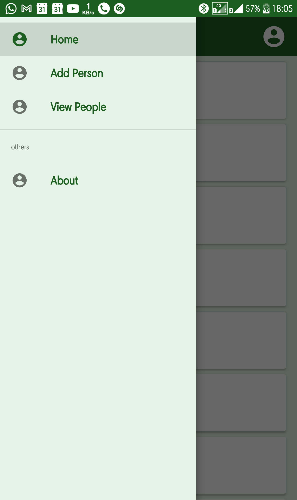
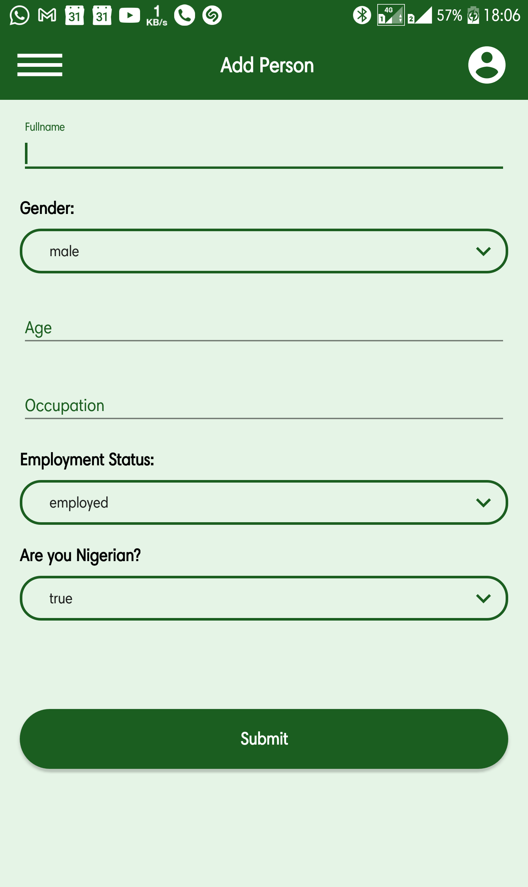

# Kontri People

A mobile app that uploads basic data of citizens to a database and also queries the same data when required.

## Features

The project uses/teaches the following

* Use of recycler view and click listeners
* Retrofit POST and GET request
* User authentication (sign-up and sign-in)
* Navigation Drawer and navGraph
* Progressbar
* Spinners
* AlertDialog

Screenshots of the project are as follows

